# Trajectory Planning and Kinematic Analysis for an RRPRRR Robot

This project focuses on trajectory planning and kinematic analysis for a 6-DOF RRPRRR robot. It was developed as part of a robotics course project at the Technion.

The project's main objectives and stages are as follows:

---

## Project Overview

- **Forward Kinematics (FK):**
  - Computed the position and orientation of the robot's end-effector based on the joint variables.

- **Inverse Kinematics (IK):**
  - Solved for the required joint configurations given desired end-effector poses.
  
  

    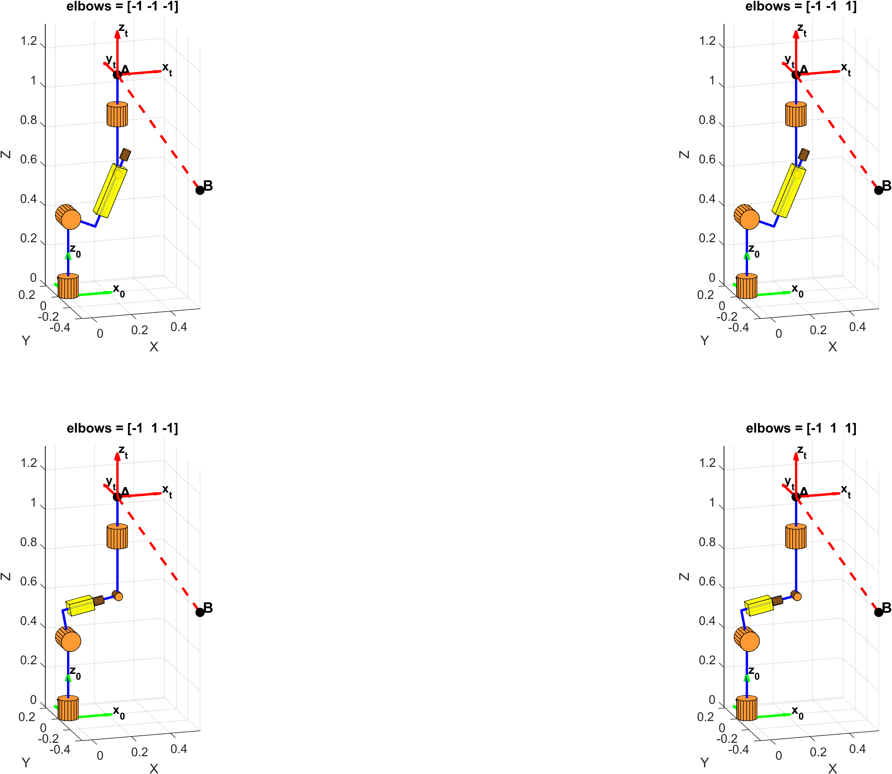
     
    Inverse Kinematics - Solution Option 1
  

  
  

    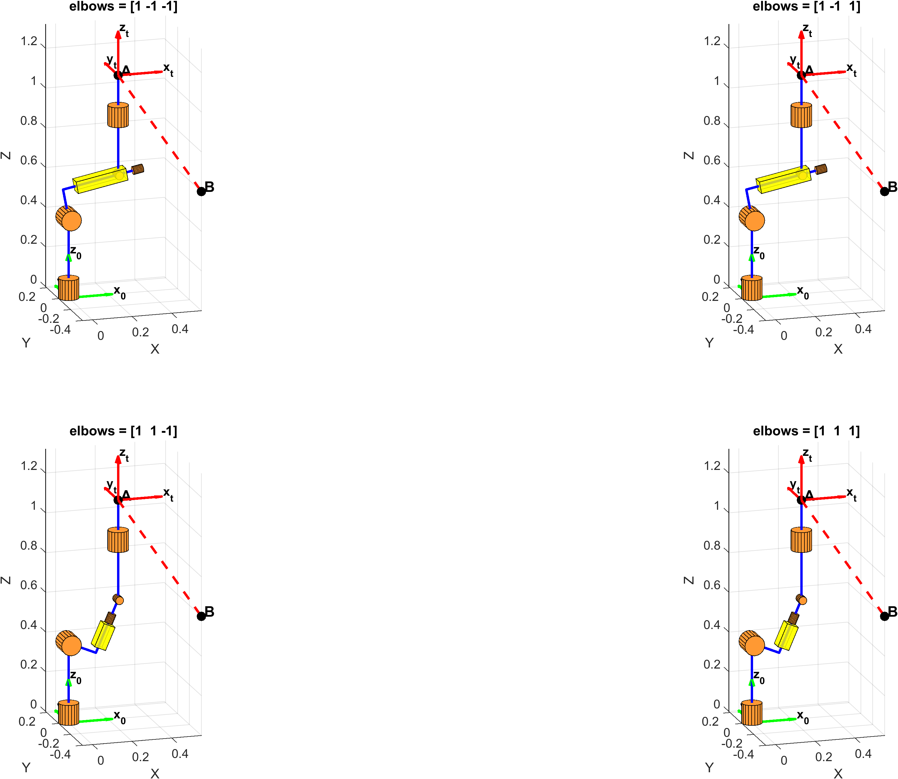
     
    Inverse Kinematics - Solution Option 2
  

  - Chosen solution: **elbows = [1, 1, 1]**

- **Jacobian Matrix Computation:**
  - Derived the full Jacobian matrix of the robot relative to both the ground frame and the climbing (moving) frame.

- **Trajectory Planning and Task Execution:**
  - Designed and analyzed robot trajectories for three types of motion profiles:
    - **Constant Velocity Trajectory (Type 1)**
    - **Trapezoidal Velocity Trajectory (Type 2)**
    - **Polynomial (Smooth) Velocity Trajectory (Type 3)**

### Motion Planning Results

**Trajectory Type 1 - Constant Velocity**

  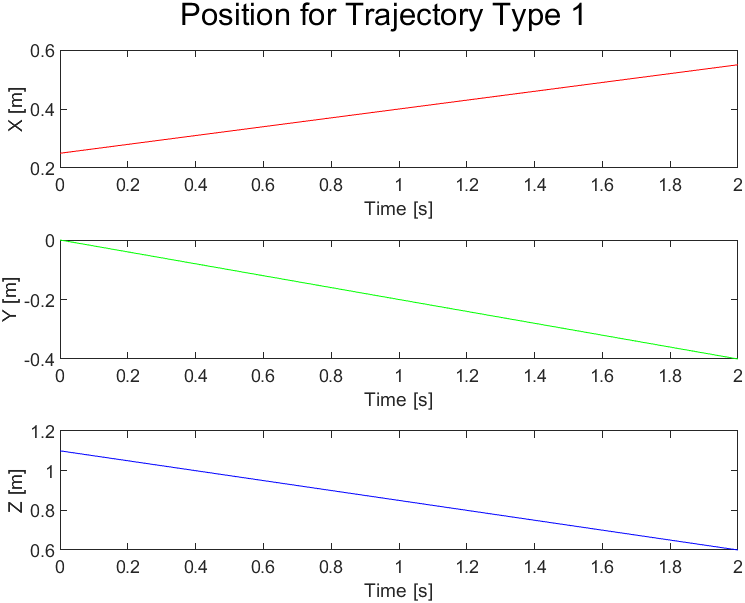
   
  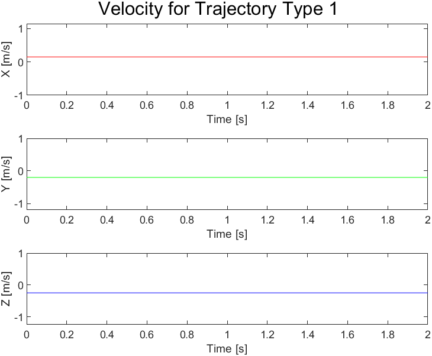
   
  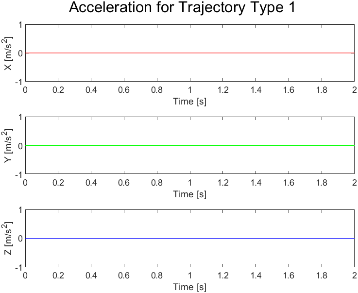

**Trajectory Type 2 - Trapezoidal Velocity**

  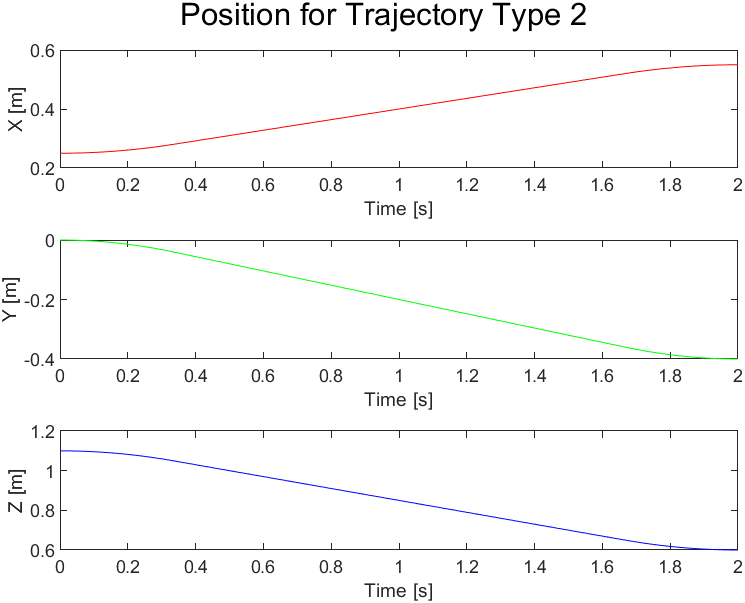
   
  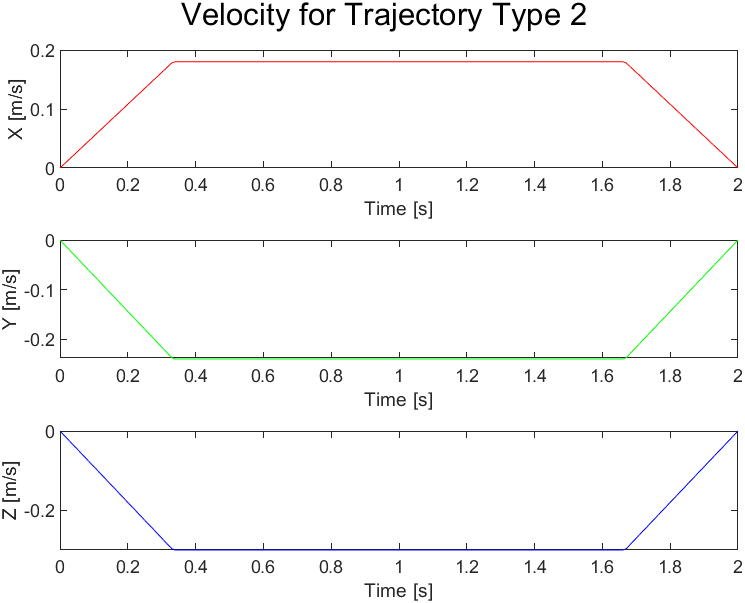
   
  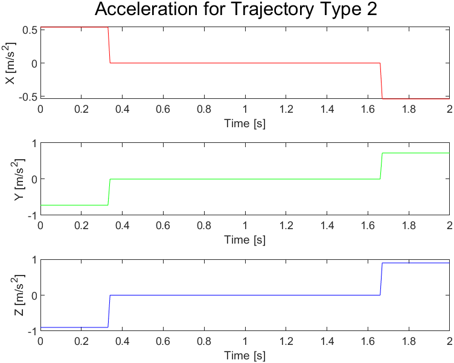

**Trajectory Type 3 - Polynomial Velocity**

  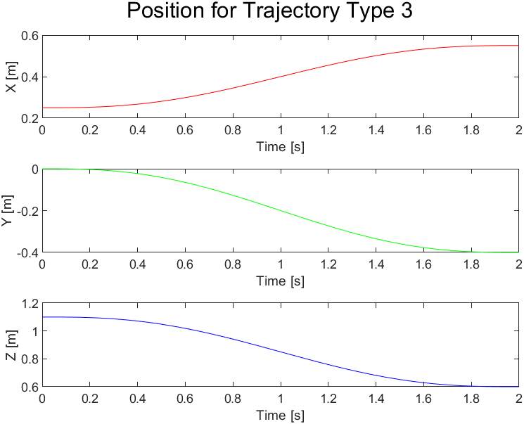
   
  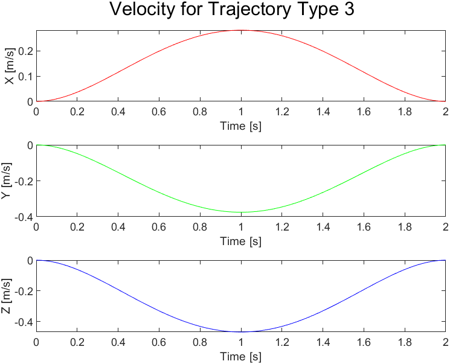
   
  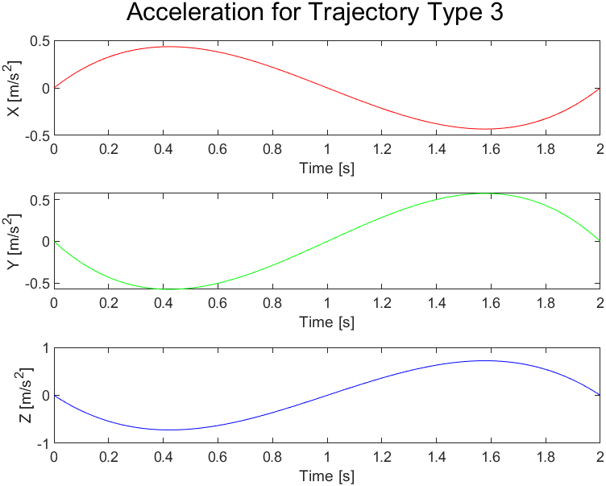

- **Performance Analysis:**
  - Analyzed the execution of each trajectory type through:
    - Graphs showing joint motions, velocities, and accelerations.
    - Robot motion simulations using MATLAB, including video animations.

---

## Methodology

1. **Kinematic Modeling:**
   - Defined axis systems for the RRPRRR robot.
   - Implemented symbolic FK and IK solutions.

2. **Jacobian Analysis:**
   - Computed the Jacobian matrix analytically.
   - Examined the velocity relationships and singularities for different configurations.

3. **Trajectory Generation:**
   - Programmed trajectories using different velocity profiles:
     - Constant: simple, direct motion but with discontinuities at start/stop.
     - Trapezoidal: smoothed acceleration/deceleration phases.
     - Polynomial: continuous and smooth derivatives up to higher orders.

4. **Simulation and Visualization:**
   - Created MATLAB scripts to simulate robot motion along the trajectories.
   - Plotted joint trajectories (position, velocity, acceleration).
   - Recorded simulation videos illustrating the robot's task execution.

---

## Simulation Videos

You can watch the robot's movements for the different trajectory types below:

- [▶ Robot Motion - Constant Velocity (Type 1)](Videos/robot_motion_type1.mp4)
- [▶ Robot Motion - Trapezoidal Velocity (Type 2)](Videos/robot_motion_type2.mp4)
- [▶ Robot Motion - Polynomial Velocity (Type 3)](Videos/robot_motion_type3.mp4)

Link to Video on YouTube:
https://youtube.com/shorts/WpSZkHUh3VQ?feature=share

---

## Repository Contents

- `FK_IK_Solutions/` — Scripts for solving Forward and Inverse Kinematics.
- `Jacobian_Analysis/` — Scripts for deriving and analyzing the Jacobian.
- `TrajectoryPlanning/` — Scripts for generating and executing different trajectory types.
- `Simulations/` — MATLAB animations and plots of robot motion.
- `Pictures/` — Figures used for documentation and analysis.
- `Videos/` — Recorded robot simulation videos.

---

## Tools Used

- MATLAB (Symbolic Math Toolbox, Robotics Toolbox)
- Graph plotting and video creation within MATLAB environment

---

## Acknowledgments

- Project conducted at the Technion - Israel Institute of Technology.
- Special thanks to course instructors and teaching assistants for their guidance.
- Project Partner - Igal Vornov

---
